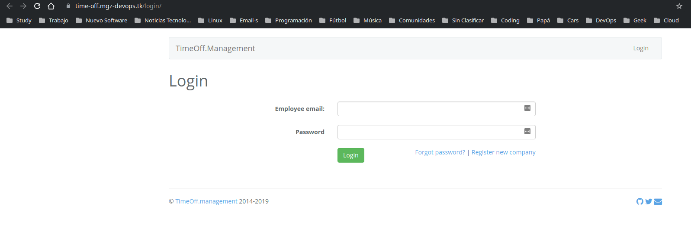
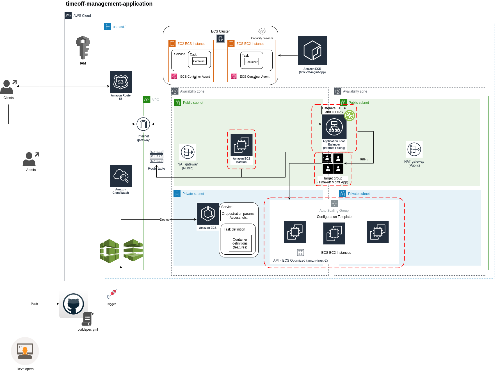
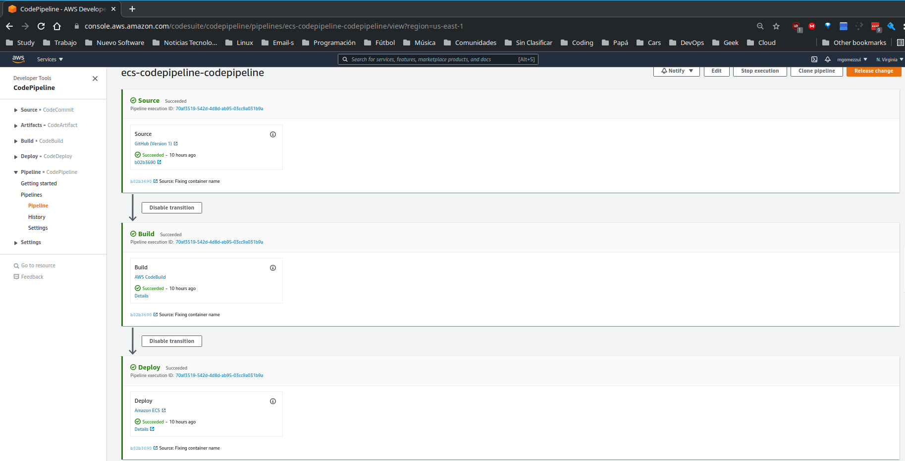

# iac_time-off_management_app
Infrastructure as Code to support Time-off Management App

## Pre-requisites

* Terraform >= 0.14.4
* AWS CLI >= 2.1.17
  * Configure credentials
* Terragrunt >= 0.31.0

## Time-off managemnt

Since the focus of the test is the DevOps component, I just modify the Dockerfile in order to create correctly the container image.

**Demo view**


## Architecture diagram



## Terraform + Terragrunt deployment

#### **Initialize remote backend**
* Following the next steps:
```sh
cd aws/us-east-1/env/global/
```

* Edit Backend configuration in the `terragrunt.hcl` and comment the following region:
```sh
emacs terragrunt.hcl
...
# remote_state {
#   backend = "s3"
#   generate = {
#     path      = "backend.tf"
#     if_exists = "overwrite_terragrunt"
#   }
#   config = {
#     bucket         = "gorillalogic-global-tf-backend-state"
#     key            = "${path_relative_to_include()}/terraform.tfstate"
#     region         = "us-east-1"
#     encrypt        = true
#     dynamodb_table = "gorillalogic-global-tf-backend-lock-state"
#   }
# }
...
```
* Deploy the remote state backend
```sh
terragrunt apply -auto-approve
```
* Edit Backend configuration in the `terragrunt.hcl` and comment-out the following region:
```sh
emacs terragrunt.hcl
...
remote_state {
  backend = "s3"
  generate = {
    path      = "backend.tf"
    if_exists = "overwrite_terragrunt"
  }
  config = {
    bucket         = "gorillalogic-global-tf-backend-state"
    key            = "${path_relative_to_include()}/terraform.tfstate"
    region         = "us-east-1"
    encrypt        = true
    dynamodb_table = "gorillalogic-global-tf-backend-lock-state"
  }
}
...
```

* Migrate the terraform state to S3 (Remote state):
```sh
terragrunt init
```

> **_NOTE:_**  Accept state migration.

> **_NOTE:_** Read `terraform-aws-tfstate-backend` [module documentation](https://github.com/cloudposse/terraform-aws-tfstate-backend)
for usage.

#### **IaC - Deployment**

* VPC
```sh
cd env/qa/time-off_mgmt/vpc
terragrunt apply -auto-approve
```

* Key Pair
```sh
cd env/qa/time-off_mgmt/key_pair
terragrunt apply -auto-approve
```

* ECR Regitry
```sh
cd env/qa/time-off_mgmt/ecr_registry
terragrunt apply -auto-approve
```

* ECS Cluster
```sh
cd env/qa/time-off_mgmt/ecs_cluster
terragrunt apply -auto-approve
```

* ECS Service
```sh
cd env/qa/time-off_mgmt/ecs_service
terragrunt apply -auto-approve
```

* Code Pipeline (Code Build)
```sh
cd env/qa/time-off_mgmt/cicd
terragrunt apply -auto-approve
```

#### Destroy Resources
Destroy is done sequentially, taking into account the following order `terragrunt destroy -auto-approve`:
- env/qa/time-off_mgmt/vpc
- env/qa/time-off_mgmt/key_pair
- env/qa/time-off_mgmt/ecr_registry
- env/qa/time-off_mgmt/ecs_cluster
- env/qa/time-off_mgmt/ecs_service
- env/qa/time-off_mgmt/cicd

---

## CI-CD Pipelines
The buildspec.yaml uses the [Example Buildspec](https://github.com/cloudposse/terraform-aws-ecs-codepipeline#example-buildspec) of the `terraform-aws-ecs-codepipeline` module, with the addition of the required modifications to deploy de Time-off Management application.


---
